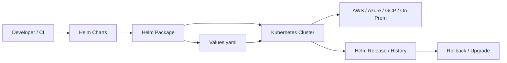

# Helm-DevOps-Guidance

Welcome to the ultimate Helm DevOps resource for recruiters, developers, and engineering teams. This repository is designed to help you understand Helm clearly, share professional DevOps guidance, and demonstrate best practices for Kubernetes deployments on AWS, Azure, GCP, and on-premises environments.

## Why this repo matters

- Perfect for recruiters and hiring managers who want to see practical Helm expertise
- Helpful for developers learning how to build repeatable, production-ready Kubernetes deployments
- Includes easy-to-share documentation for LinkedIn, training, and team references
- Focused on clarity, real-world workflows, and cloud integration patterns

## Included guides

- `Helm-Concept-For-DevOps.md` — core Helm concepts and DevOps value
- `Helm-Usage-And-Integration-For-DevOps.md` — when, why, and how to use Helm plus Kubernetes integration
- `Helm-Cloud-and-OnPrem-Integration-Guide.md` — step-by-step Helm integration for AWS, Azure, GCP, and on-premises

## How to use this repo

1. Read the concept guide to learn Helm fundamentals.
2. Use the usage guide to understand deployment patterns and automation.
3. Follow the cloud integration guide for real-world platform-specific setup.

## DevOps architecture diagram

## Impress your audience

This repository is built to showcase:

- clear DevOps thinking
- practical Helm workflows
- multi-cloud Kubernetes integration
- strong documentation skills

Thanks for visiting — feel free to share this with your network or use it as a template for your own Helm-driven DevOps projects.
